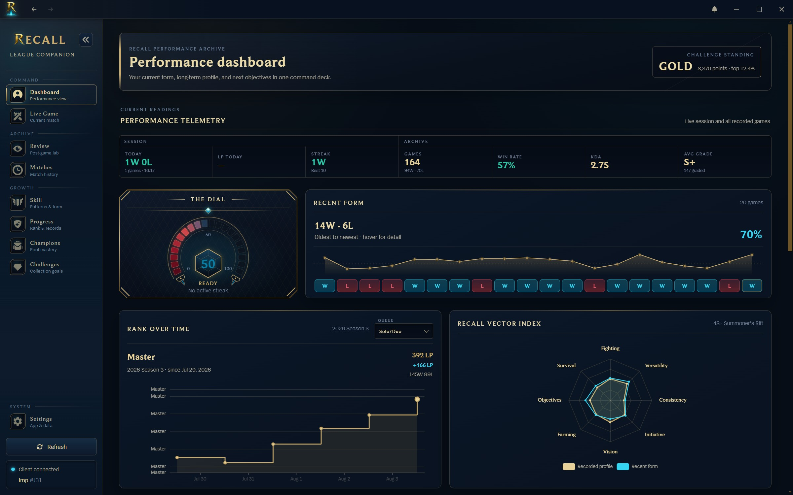
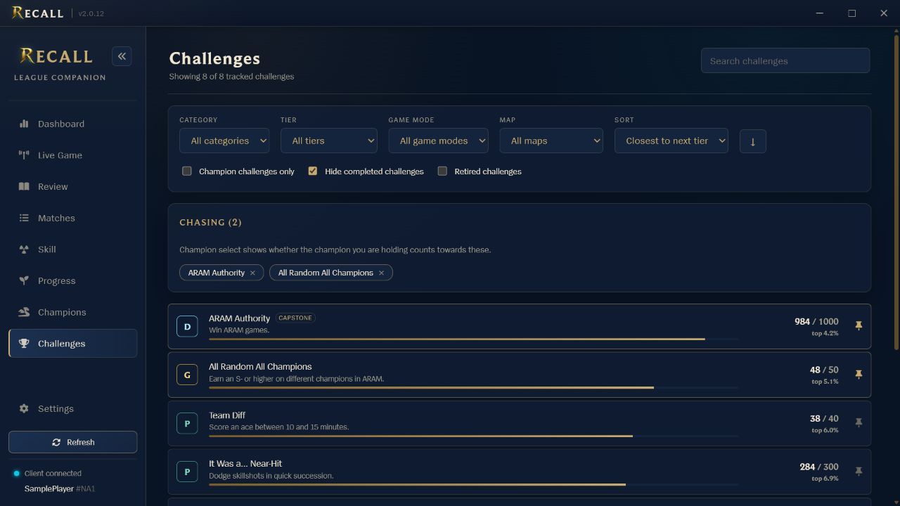
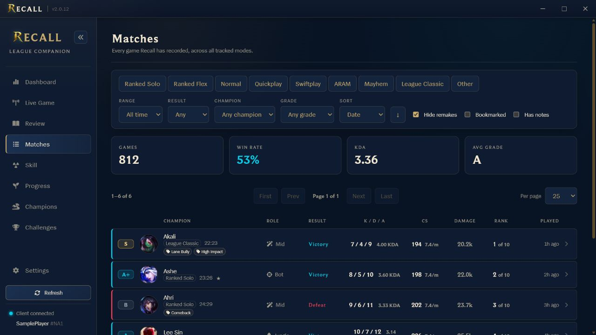

# Recall

Recall is a Windows desktop companion for League of Legends that keeps the
history the client forgets. It records your matches in a local database, tracks
challenge progress, follows ranked movement, grades your games, and gives you a
useful place to review what actually happened after the post-game lobby is
gone.

I built Recall because I wanted more than a rolling list of 20 games and a
collection of challenge bars. If I am trying to finish a champion challenge,
clean up a bad habit, or figure out which picks have been working lately, I
want the answer in one place and I want the underlying games to still be there
next month.

[Download Recall for Windows](https://github.com/KleinByte/Recall/releases/latest/download/Recall-Windows-Setup.exe)

[☕ Buy me a coffee](https://ko-fi.com/kleinbyte)



## What it does

- Saves supported matches locally so your useful history does not disappear
  when it rolls out of the League client.
- Tracks ARAM, ARAM: Mayhem, League Classic, Ranked Solo/Duo, Ranked Flex,
  Normal, Quickplay, and Swiftplay as distinct modes.
- Turns challenge data into something you can plan around with search,
  category and tier filters, completion filters, sorting, and pinned goals.
- Shows whether the champion you are hovering in champion select still counts
  toward a pinned champion challenge.
- Grades complete scoreboards from S+ through D using position opportunities,
  detailed champion archetype responsibilities, and a frozen local reference.
- Keeps ranked snapshots, personal records, champion results, mastery context,
  playstyle trends, lobby comparisons, and a mode-specific Recall Vector Index
  with mode-appropriate match arms, a career Range arm, and inspectable evidence.
- Provides a review journal with bookmarks, notes, tags, session boundaries,
  timeline events, and reusable practice experiments.
- Stores everything on your machine and includes integrity checks, verified
  backups, and safe restoration in the Data Trust Center.

## Challenges you can actually work with

The client is good at telling you that a challenge exists. Recall is built to
help you finish it. The challenge browser can sort by distance to the next
tier, current tier, name, category, or last update. Completed challenges are
hidden by default, and retired challenges stay available when you need them for
reference.

Champion challenges show which champions are done and which are still needed.
Pin the challenges you are chasing and Recall can surface the answer during
champion select without making you dig through the client.



Challenge rows and dashboard shortcuts open the details that matter: the
current and next tier, exact progress, points, percentile, supported modes, and
champion completion count.

## Match history and review

Recall syncs when it starts, after a game, and periodically while the League
client is available. Each complete match can include both teams, participant
stats, performance grades, builds, augments, objectives, multikills, and the
context needed to understand why a result looked good or bad.

The history view is paged and can be filtered or sorted by mode, result,
champion, grade, date, duration, KDA, damage, bookmarks, notes, tags, and
experiments. Its rows keep champion, assigned role, result, KDA, CS pace,
damage, lobby rank, and date aligned for quick scanning. League Classic has its
own filter instead of being folded into Other.



The Review page explains the exact grading recipe, shows the informational
lobby percentile separately from Recall Score, and groups games into sessions so a
rough night does not get flattened into a lifetime average. Full scoreboards
are ordered like Riot's lanes, while modes without assigned roles omit the
role presentation entirely.

Recall captures recent timelines from the authenticated local League Client and
caches a compact summary. The exact event families vary with what the current
client build exposes; periodic gold, experience, position, kill, and structure
data are kept when available. The original response is retained locally beside
the compact summary so later Recall versions can reprocess fields from the
unsupported, changing LCU schema. No developer key is used for normal timeline
requests. Final builds and ward totals come from the complementary local game
summary; Recall does not infer individual ward events when the timeline omits
them.

While a game is running, Recall also captures the loopback Live Client Data
feed. It stores a full player-state snapshot every 15 seconds and immediately
when an inventory or level changes, while cumulative live events are stored
once by Riot's event id. These local captures can restore approximate item and
level timing to the post-game review when match history omits those events.
Games played while Recall is closed cannot be reconstructed this way.

## How history syncing works

There are two sources of match data, and they have different limits.

The locally running League client exposes only its most recent 20 games across
all modes. Recall checks that window often and permanently saves new games, but
the client cannot provide a deeper local archive. For the best coverage, run
Recall regularly instead of waiting months between syncs.

For the fullest starting archive, add a personal Riot development key in
Settings and run the Match-V5 history import at least once. Recall resumes that
import after restarts and respects the rate limits reported by Riot. Normal
post-game sync, full recent scoreboards, grades, labels, and recent timelines
remain local and keyless. Development keys expire after 24 hours, so a long
import may require a freshly generated key before it can resume.

Some rotating modes are not consistently exposed through Match-V5. ARAM:
Mayhem games can still be recorded when they appear in the League client's
recent-game window, but an API backfill cannot recover a match that Riot does
not return. Recall reports those source limits instead of pretending a partial
archive is complete.

League Classic is treated as its own mode throughout Recall. Its matches,
filters, performance grades, Recall Vector Index, champion results, and saved
item art stay separate from modern Summoner's Rift. Classic item icons are
bundled from Riot's Data Dragon catalog, so recorded builds remain readable
without borrowing modern item art.

## Performance grades

Riot does not provide a post-game letter grade through the local client API, so
Recall calculates a 0–100 Recall Score from complete scoreboards. It compares
the performance with similar games in that installation's saved history.
Another installation builds its own comparison baseline and never receives
yours. Each tracked game mode freezes independently. Settings can recalibrate
all eligible modes from up to their 100 most recent complete games; the new
baseline applies to future games while older match grades keep the comparison
they originally used.

Position determines opportunity while the champion's detailed archetype
determines responsibility. Zac remains a Jungler but is evaluated as a
Vanguard; Tristana remains Bottom or Middle but is evaluated primarily as a
Marksman. Recall organizes the Grade into Combat, Survival, Utility, Economy,
Macro, Vision, and Initiative. A missing core measurement withholds the Grade.
Available optional measurements join at their declared weights, while missing
optional stats stay missing and never count as zero.
Observed zero, unavailable data, no opportunity, and not-applicable evidence
remain distinct throughout that calculation.

The reference uses leave-one-match-out empirical calibration and treats a
complete match—not ten correlated participant rows—as the independent unit.
The final letter comes directly from Recall Score. Lobby
percentile remains visible as separate context and does not set the grade.
League Classic, ARAM, and each tracked rules scope remain separate, so their
pace and economy are not mixed with modern Summoner's Rift.

Grade and the Recall Vector Index consume the same calibrated observations.
The applicable match radar arms combine into Recall Score and the letter Grade.
Summoner's Rift uses seven match arms. ARAM and ARAM Mayhem use only Combat,
Survival, Utility, and Economy. Expand an arm to inspect each raw statistic,
formula, score, coverage, comparison group, evidence state, arm share, and
resulting Grade influence.

Career RVI averages the career arms with enough data. Its eighth arm, Range,
rewards steady results and breadth across positions, archetypes, and champions
after enough recorded games. Range never enters a single-match Grade.

The selected RVI recipe remains linked to the exact Grade recipe and comparison
baseline. Rebuilding creates a verified backup and replaces derived Grades and
metric observations while preserving raw matches, source payloads, timelines,
reviews, notes, and settings. Timeline measurements contribute only when the
retained source supports their formula. If a match lacks a complete or
source-verifiable scoreboard, Recall keeps the available data and explains why
a Grade cannot be produced.

## Install

Recall currently supports Windows.

1. Download the installer from the
   [latest Windows installer](https://github.com/KleinByte/Recall/releases/latest/download/Recall-Windows-Setup.exe).
2. Run the installer.
3. Start League and open Recall. The first sync begins automatically.

Current installers are Authenticode-signed and timestamped under Jordyn
Kleinheksel with a Microsoft ID Verified certificate. SmartScreen may still
show an "unrecognized app" warning while the new publisher identity builds
download reputation. Verify that the publisher and release hash match before
running any installer.

Recall checks GitHub Releases for updates after the packaged app starts. New
versions download in the background, then Settings offers **Restart to update**.
Recall shows installation progress, blocks an older build from opening the
database during the handoff, and preserves a verified database snapshot.

## Build from source

Recall's development toolchain is pinned to Node.js 24.19.0 LTS and pnpm 11.22.0.
Version managers can read `.node-version`; Corepack reads the exact pnpm version
from `package.json`.

```sh
corepack enable
corepack prepare pnpm@11.22.0 --activate
pnpm install
pnpm dev
```

Useful commands:

```sh
pnpm typecheck
pnpm test
pnpm test:e2e # run after build:renderer
pnpm verify
pnpm build
```

`better-sqlite3` is a native dependency. The application copy is compiled for
Electron, while `better-sqlite3-node` provides the regular Node ABI used by the
test suite. Both entries are pinned to the same package version and pnpm keeps
their files separate so rebuilding one ABI cannot overwrite the other. A normal
install prepares both copies; use these commands to diagnose or repair a
native-runtime mismatch:

```sh
pnpm doctor:native
pnpm rebuild:electron
pnpm rebuild:node
```

`pnpm verify` runs repository hygiene checks, both typecheckers, the complete
test suite, the renderer/main/preload build, and both native-runtime probes.
`pnpm verify:ci` additionally launches the built app through Playwright at the
minimum window size and common display scaling, then creates an unpacked
application and runs the packaged-runtime inspection used by CI.

`node-abi` is intentionally listed directly because electron-builder's pnpm
dependency walker needs that install-time transitive dependency at the project
root while assembling the external native module. Recall does not import it at
runtime.

### Isolated Docker development profile

Recall uses an embedded SQLite database rather than a network database server.
The Compose setup therefore gives the development app a dedicated Docker volume
for its full Electron user-data directory (`stats.db`, settings, and backups).
It never mounts, copies, or migrates the normal Recall profile.

```sh
docker compose up --build
```

Open [noVNC](http://localhost:6080/vnc.html?autoconnect=true&resize=remote) to
use the development Electron window. The Vite server is also available at
http://localhost:3344. The database is retained when you stop the stack with
`docker compose down`; it is isolated in the `recall-development_recall-dev-user-data`
named volume.

To inspect that development database, while the app is stopped, run:

```sh
docker compose run --rm sqlite
```

The container cannot discover or connect to a League client running on Windows,
so use this profile for UI and database debugging with test data. For a local
desktop debug run that still talks to League, set `RECALL_USER_DATA_DIR` to an
empty directory before running `pnpm dev`; that uses the same isolated-profile
guard without Docker.

To let the Docker development app connect to League on Windows, first enable
Docker Desktop's opt-in **host networking** feature and restart Docker Desktop.
Start and sign in to League, then run the additional Compose profile:

```powershell
$env:RECALL_LEAGUE_DIR = "C:\Riot Games\League of Legends" # change if needed
docker compose -f compose.yaml -f compose.league.yaml up --build
```

Open the same noVNC URL. The override mounts the League installation read-only
so Recall can watch its rotating lockfile, and host networking lets the
container reach the LCU and in-game Live Client APIs on Windows loopback. It
does not publish either authenticated Riot API port. Host networking gives the
container broader access to host TCP/UDP services, so use this only with the
local Recall image and dependencies you trust.

## Data and privacy

Recall stores match history, challenge snapshots, review notes, and settings
locally in its user data directory. The database survives application updates.

If you configure a Riot API key, Recall encrypts it with operating-system
secure storage. Authenticated account, match-history, and requested timeline
calls go directly from the main process to Riot. The key and full external
PUUID are not sent to the renderer or written to logs.

The League client challenge payload includes a `friendsAtLevels` field with
friend identifiers. Recall discards that field, and the test suite verifies
that behavior.

## Riot disclaimer

Recall is not endorsed by Riot Games and does not reflect the views or opinions
of Riot Games or anyone officially involved in producing or managing Riot Games
properties. Riot Games and all associated properties are trademarks or
registered trademarks of Riot Games, Inc.

## Contributing

Contributions are welcome. Before submitting a pull request, read
[CONTRIBUTING.md](CONTRIBUTING.md) and the
[Recall Contributor License Agreement](CLA.md). Contributors retain ownership
of their contributions while granting the project owner the rights needed to
offer Recall under both public noncommercial and separate commercial terms.

## License

Recall is source-available under the
[PolyForm Noncommercial License 1.0.0](LICENSE). Personal and other permitted
noncommercial use, modification, and distribution are allowed under that
license. Commercial use requires a separate license from KleinByte; contact
[KleinByte on GitHub](https://github.com/KleinByte) for commercial licensing.

This is a source-available license, not an OSI-approved open-source license.
Third-party components and Riot Games materials remain subject to their own
terms.
