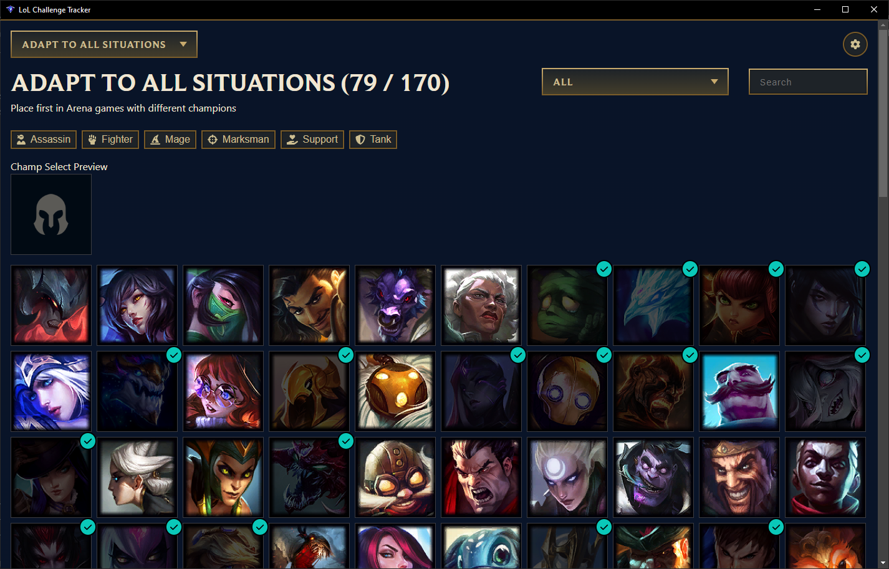

# Recall

> A League of Legends companion that remembers what the client forgets — every challenge, every tracked game, permanently.



# How to use

It's better to launch the LoL client before

> An error popup could appear in some rare cases, you can safely ignore it

## What Recall tracks

**Challenges** — all of them. Recall imports your entire challenge catalogue,
not a hand-picked subset, with tier progress, points, percentile and the full
tier ladder. Champion-based challenges expand into a grid showing exactly which
champions you still need.

**Matches** — Ranked Solo/Duo, Ranked Flex, Normal, Quickplay, Swiftplay, ARAM
and ARAM: Mayhem. Arena and the rotating modes are not tracked.

Each mode shows what actually matters for it: creep score, vision, objectives
and lane on Summoner's Rift; damage, healing and mitigation in ARAM.

**Champions** — champion mastery combined with your own recorded results and,
usefully, which challenges each champion still counts toward. That answers
"who should I play next" in a way the client cannot.

### Performance grades

Every game gets a letter grade from S+ down to D.

Riot does not expose a grade through the local client API, so Recall derives one
by comparing you against the other nine players in that same game. On Summoner's
Rift, role-sensitive statistics like creep score are measured against others in
your role — a support is not marked down for farming less than the mid laner. An
average game lands on a B.

Grading needs one extra request per game, so it runs after matches are recorded.
A game that has already aged out of the client's history cannot be graded
retroactively and will show no grade.

## The 20-game limit

The League client only ever exposes your **most recent 20 games**, shared across
all modes. Requests for anything older are accepted and silently ignored, and no
other local endpoint offers more.

Recall works around this by re-reading that window on launch, after each game
and periodically, storing anything it has not seen before. So:

- Everything you play from installation onward is kept permanently, with no limit.
- On first run, up to your last 20 games are imported.
- Games played while Recall is closed are still picked up, provided you have not played more than 20 since it last ran.
- Games from before you installed Recall cannot be recovered. Nothing can retrieve them.

Match history is paged and filterable by mode, result, champion, grade, date and
duration, so a large archive stays usable.

Challenge progress is also snapshotted whenever a value changes, which lets
Recall show progress over time — something the client, which only reports current
values, cannot do.

The database lives in your user data folder and survives app updates. Its exact
path is shown on the Settings page, along with export and reset actions.

# Install (Windows only)

Go to the [latest release](https://github.com/nyquase/lol-challenge-tracker/releases/latest)

> Windows will warn you that this exe is not safe, because it's a pain to sign an exe. Feel free to look at the code to see what it does.

# Build

```sh
pnpm install
```

Try in dev mode

```sh
pnpm dev
```

Run the tests

```sh
pnpm test
```

Build for release

```sh
pnpm build
```

## A note on SQLite

The app uses `better-sqlite3`, a native module. It is compiled against the
Electron runtime for the app itself, and a second copy (`better-sqlite3-node`)
is kept at the plain Node ABI so the test suite can run outside Electron.

## Privacy

Recall stores your own data locally and sends nothing anywhere. The challenge
payload from the client includes a `friendsAtLevels` field listing your friends'
identifiers; Recall deliberately discards it, and a test enforces that.
