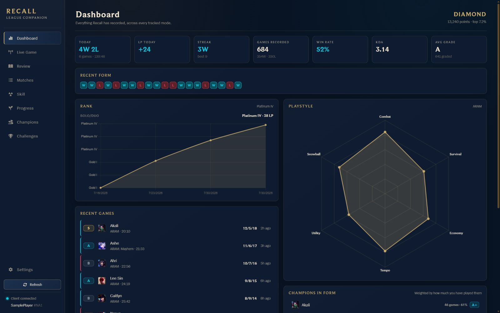
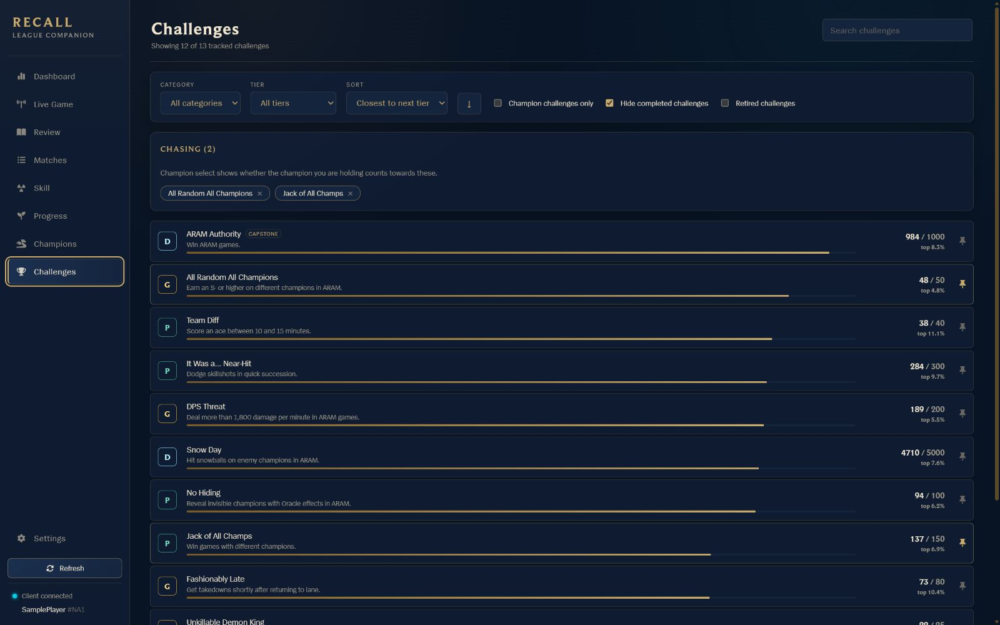
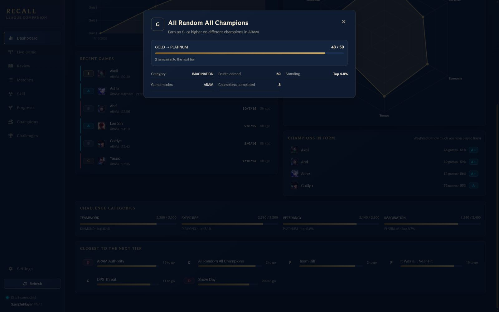

# Recall

Recall is a Windows desktop companion for League of Legends that keeps the
history the client forgets. It records your matches in a local database, tracks
challenge progress, follows ranked movement, grades your games, and gives you a
useful place to review what actually happened after the post-game lobby is
gone.

I built Recall because I wanted more than a rolling list of 20 games and a
collection of challenge bars. If I am trying to finish a champion challenge,
clean up a bad habit, or figure out which picks have been working lately, I
want the answer in one place and I want the underlying games to still be there
next month.

[Download the latest Windows release](https://github.com/KleinByte/Recall/releases/latest)



## What it does

- Saves supported matches locally so your useful history does not disappear
  when it rolls out of the League client.
- Tracks ARAM, ARAM: Mayhem, Ranked Solo/Duo, Ranked Flex, Normal, Quickplay,
  and Swiftplay.
- Turns challenge data into something you can plan around with search,
  category and tier filters, completion filters, sorting, and pinned goals.
- Shows whether the champion you are hovering in champion select still counts
  toward a pinned champion challenge.
- Grades complete scoreboards from S+ through D by comparing your performance
  with the other players in that match.
- Keeps ranked snapshots, personal records, champion results, mastery context,
  playstyle trends, and lobby comparisons.
- Provides a review journal with bookmarks, notes, tags, session boundaries,
  timeline events, and reusable practice experiments.
- Stores everything on your machine and includes integrity checks, verified
  backups, and safe restoration in the Data Trust Center.

## Challenges you can actually work with

The client is good at telling you that a challenge exists. Recall is built to
help you finish it. The challenge browser can sort by distance to the next
tier, current tier, name, category, or last update. Completed challenges are
hidden by default, and retired challenges stay available when you need them for
reference.

Champion challenges show which champions are done and which are still needed.
Pin the challenges you are chasing and Recall can surface the answer during
champion select without making you dig through the client.



Challenges shown on the dashboard open in place with the details that matter:
the current and next tier, exact progress, points, percentile, supported modes,
and champion completion count.



## Match history and review

Recall syncs when it starts, after a game, and periodically while the League
client is available. Each complete match can include both teams, participant
stats, performance grades, builds, augments, objectives, multikills, and the
context needed to understand why a result looked good or bad.

The history view is paged and can be filtered or sorted by mode, result,
champion, grade, date, duration, KDA, damage, bookmarks, notes, tags, and
experiments. The Review page explains the grading calculation, compares a game
only with matches that happened before it, and groups games into sessions so a
rough night does not get flattened into a lifetime average.

Recall captures recent timelines from the authenticated local League Client and
caches a compact summary. The exact event families vary with what the current
client build exposes; periodic gold, experience, position, kill, and structure
data are kept when available. Raw timeline responses are not stored, and no
developer key is used for normal timeline requests.

## How history syncing works

There are two sources of match data, and they have different limits.

The locally running League client exposes only its most recent 20 games across
all modes. Recall checks that window often and permanently saves new games, but
the client cannot provide a deeper local archive. For the best coverage, run
Recall regularly instead of waiting months between syncs.

You can optionally add a personal Riot API key in Settings. It is used only for
the full Match-V5 history import started there. Recall resumes that import after
restarts and respects the rate limits reported by Riot. Normal post-game sync,
full recent scoreboards, grades, labels, and recent timelines remain local and
keyless. Developer keys expire on Riot's schedule, so a key that worked
yesterday may need to be regenerated.

Some rotating modes are not consistently exposed through Match-V5. ARAM:
Mayhem games can still be recorded when they appear in the League client's
recent-game window, but an API backfill cannot recover a match that Riot does
not return. Recall reports those source limits instead of pretending a partial
archive is complete.

## Performance grades

Riot does not provide a post-game letter grade through the local client API, so
Recall calculates one from the full lobby. An average performance lands around
a B. Strong games move into A and S territory, while weak games fall below the
lobby baseline.

Summoner's Rift grading is role-aware. A support is not punished for farming
less than a mid laner, and a tank is not expected to produce the same damage
profile as a carry. The Review page shows the lobby percentile, component
weights, and each weighted contribution. If a match does not include a complete
scoreboard, Recall keeps the available data and explains why a detailed grade
cannot be produced.

## Install

Recall currently supports Windows.

1. Download the installer from the
   [latest release](https://github.com/KleinByte/Recall/releases/latest).
2. Run the installer.
3. Start League and open Recall. The first sync begins automatically.

Windows may show a SmartScreen warning because the installer is not
code-signed. The application and release workflow are available in this
repository if you want to inspect exactly what is being installed.

Recall checks GitHub Releases for updates after the packaged app starts. New
versions download in the background, then Settings offers **Restart to update**.
Recall never restarts itself, and app updates preserve the local database.

## Build from source

You will need Node.js and pnpm.

```sh
pnpm install
pnpm dev
```

Useful commands:

```sh
pnpm typecheck
pnpm test
pnpm build
```

`better-sqlite3` is a native dependency. The application copy is compiled for
Electron, while `better-sqlite3-node` provides the regular Node ABI used by the
test suite.

## Data and privacy

Recall stores match history, challenge snapshots, review notes, and settings
locally in its user data directory. The database survives application updates.

If you configure a Riot API key, Recall encrypts it with operating-system
secure storage. Authenticated account, match-history, and requested timeline
calls go directly from the main process to Riot. The key and full external
PUUID are not sent to the renderer or written to logs.

The League client challenge payload includes a `friendsAtLevels` field with
friend identifiers. Recall discards that field, and the test suite verifies
that behavior.

## Riot disclaimer

Recall is not endorsed by Riot Games and does not reflect the views or opinions
of Riot Games or anyone officially involved in producing or managing Riot Games
properties. Riot Games and all associated properties are trademarks or
registered trademarks of Riot Games, Inc.
