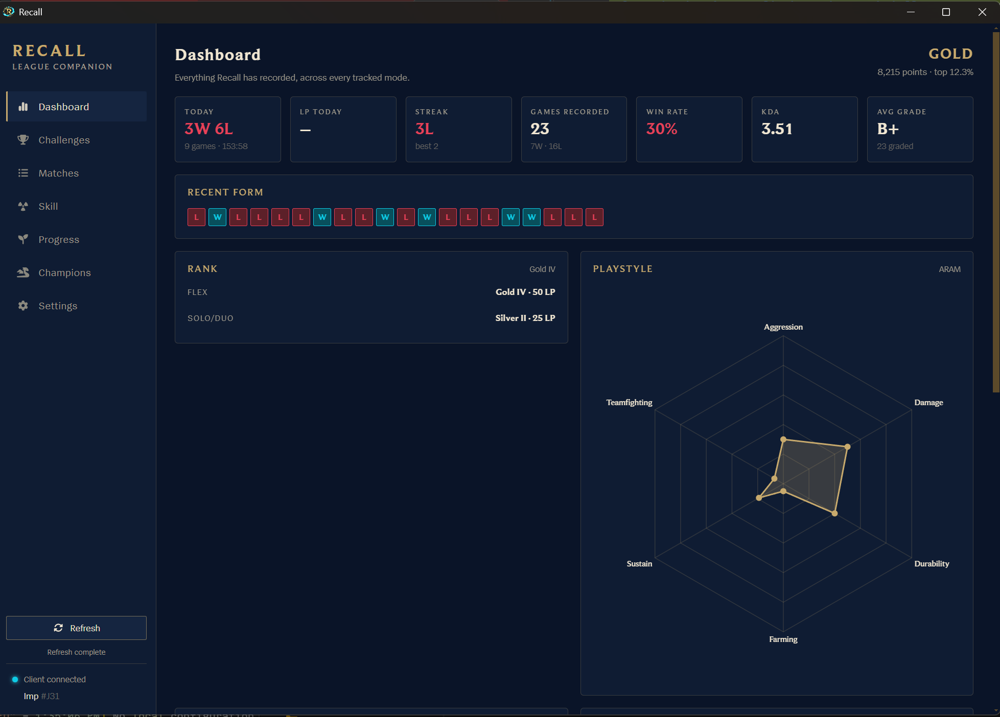

# Recall

> A local League of Legends companion for permanent match history, challenge planning, champion progress, ranked goals, and playstyle analysis.



## What Recall does

**Keeps your history** — Recall saves supported matches locally so the League
client's rolling history window does not erase games you have already synced.

**Turns challenges into a champion plan** — browse and filter every challenge,
see champion-specific requirements, and pin what matters. While in champion
select, Recall can show whether the champion you are hovering still advances a
pinned challenge.

**Shows the full game** — open a recorded match to compare both teams and
expand a player for combat, economy, vision, objective, multikill, and setup
statistics when the League client provided full game detail.

**Connects champion results to mastery and challenges** — compare champion
mastery, your results, ranked performance, and remaining champion-specific
challenge requirements.

**Tracks progress over time** — review ranked LP snapshots, set rank and
challenge goals, view personal records, and explore mode-specific playstyle
trends and lobby comparisons.

**Builds a personal review journal** — explain every grade, compare a game only
with matches played before it, review sessions, bookmark important games, keep
notes and tags, and run reusable practice experiments.

## Connected to the League client

Recall reads the locally running League Client on Windows. It syncs on launch,
after a game, and periodically while the client is available. Use **Refresh**
when you want to sync matches, challenges, ranked snapshots, and profile data
immediately.

Pinned champion challenges can also appear in a small, draggable overlay during
champion select. It marks whether the champion you are hovering still advances
each pinned challenge.

## Supported modes

Recall records Ranked Solo/Duo, Ranked Flex, Normal, Quickplay, Swiftplay,
ARAM, and ARAM: Mayhem. Arena and rotating modes are not currently tracked.

### Performance grades

Every complete scoreboard gets a letter grade from S+ down to D.

Riot does not expose a grade through the local client API, so Recall derives one
by comparing you against the other nine players in that same game. On Summoner's
Rift, role-sensitive statistics like creep score are measured against others in
your role — a support is not marked down for farming less than the mid laner. An
average game lands on a B.

The Review page shows the lobby percentile, component weights, and weighted
contributions produced by that same grading calculation. Imported Match-V5
scoreboards can be graded retroactively; a game without a complete lobby keeps
its existing grade and explains why no breakdown is available.

## Local and Riot history

The League client exposes only its **most recent 20 games**, shared across all
modes. Requests for anything older are accepted and silently ignored, and no
other local endpoint offers more. Recall still re-reads that window on launch,
after each game, and periodically so new matches are captured without a web API
key.

Optionally, add a personal `RGAPI-…` Web API key in Settings. Recall encrypts it
using operating-system secure storage and uses Match-V5 to import every match
Riot still exposes for the signed-in account. Imports resume after restarts,
share Riot's observed application and method rate limits, and refresh new
history with a 24-hour overlap after the initial scan.

Match timelines are never fetched automatically just because a review opens.
Use **Load timeline**, or bookmark the match, to fetch and permanently cache a
compact local summary. Timeline v2 presents champion kills and deaths with
assists, named item transactions with icons, levels, wards, objectives, the
owner's purchase path, team-gold movement, and measured turning points. Raw
Riot timeline responses are not stored.

Recall records ordered augment selections for every participant present in the
completed-game payload. The Review scoreboard displays those selections, while
personal augment context is limited to the signed-in player's games, champions,
average grade, KDA, and damage per minute. Recall deliberately does not publish
augment win rates, rankings, or recommendations. **Enrich historical details**
in Settings can replay accessible Match-V5 history through the durable,
rate-limited importer to populate new fields on older matches.

Match history is paged, filterable, and sortable by mode, result, champion,
grade, date, duration, KDA, damage, bookmark, notes, tags, and experiments, so
a large archive stays usable.

Challenge progress is also snapshotted whenever a value changes, which lets
Recall show progress over time — something the client, which only reports current
values, cannot do.

The database lives in your user data folder and survives app updates. Settings
includes a Data Trust Center for integrity checks, history coverage, sync
health, verified backups, and safe restoration.

# Install (Windows only)

Go to the [latest release](https://github.com/KleinByte/Recall/releases/latest)

> Windows will warn you that this exe is not safe, because it's a pain to sign an exe. Feel free to look at the code to see what it does.

## Updates

Recall checks public GitHub Releases after a packaged app starts. A newer
release downloads in the background; Settings shows its progress and offers
**Restart to update** when it is ready. Recall never restarts itself and keeps
its user data and local database through the update.

To publish a release, set `package.json` to the release version, commit it,
then create and push the matching `v<version>` tag. The Release workflow builds
the Windows installer and publishes its installer, blockmap, and updater
metadata to GitHub Releases.

# Build

```sh
pnpm install
```

Try in dev mode

```sh
pnpm dev
```

Run the tests

```sh
pnpm test
```

Build for release

```sh
pnpm build
```

## A note on SQLite

The app uses `better-sqlite3`, a native module. It is compiled against the
Electron runtime for the app itself, and a second copy (`better-sqlite3-node`)
is kept at the plain Node ABI so the test suite can run outside Electron.

## Privacy

Recall stores review data locally. If you configure a Riot Web API key, the main
process sends authenticated account, match-history, and on-demand timeline
requests directly to Riot; the key and full external PUUID never reach the
renderer or logs. The challenge payload from the client includes a
`friendsAtLevels` field listing your friends' identifiers; Recall deliberately
discards it, and a test enforces that.

Recall is not endorsed by Riot Games and does not reflect the views or opinions
of Riot Games or anyone officially involved in producing or managing Riot Games
properties. Riot Games and all associated properties are trademarks or
registered trademarks of Riot Games, Inc.
